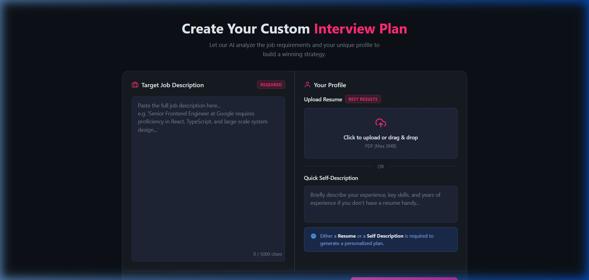
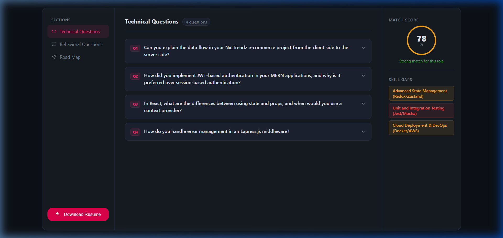
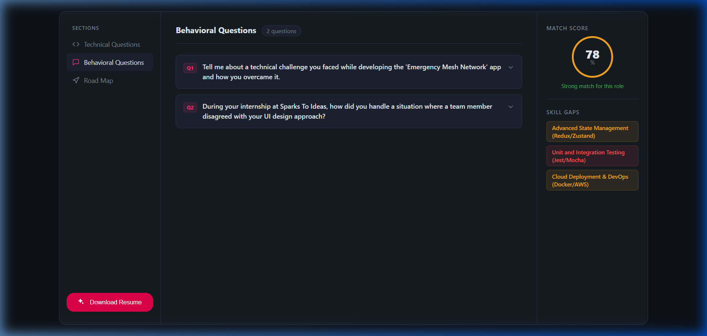
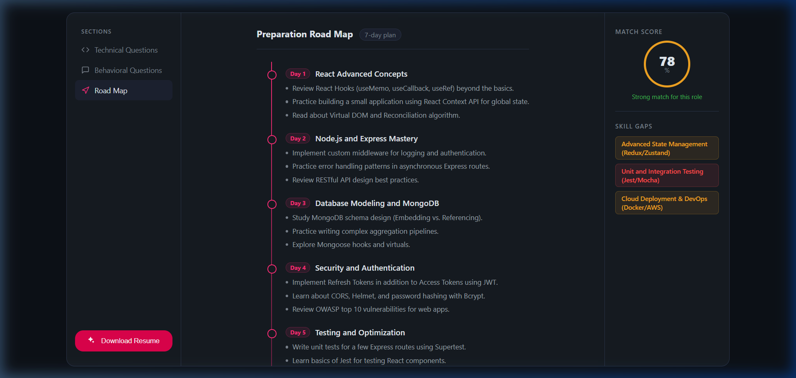

# 🤖 AI Interview Prep & Resume Builder

An AI-powered full-stack web application that helps candidates prepare for job interviews by analyzing their resume and job description using **Google Gemini AI** — and generating personalized interview reports and ATS-optimized resumes.

---

## 📸 Screenshots

### Authentication
| Login | Register |
|-------|----------|
|  |  |

### Dashboard
| Home Dashboard | Interview Form |
|----------------|----------------|
|  |  |

### AI Generated Report
| Technical Questions | Behavioral Questions | Preparation Map |
|---------------------|----------------------|-----------------|
|  |  |  |

---

## ✨ Features

- 📄 **Resume Analysis** — Upload your resume PDF or write a self-description
- 🧠 **AI Interview Report** — Get tailored technical & behavioral questions with model answers
- 🎯 **Job Match Score** — See how well your profile matches the job description (0–100)
- ⚠️ **Skill Gap Analysis** — Identify missing skills with severity ratings (low / medium / high)
- 📅 **Day-wise Prep Plan** — Structured preparation plan generated by AI
- 📝 **AI Resume Generator** — Generates an ATS-friendly, job-tailored resume as a downloadable PDF
- 🔐 **JWT Authentication** — Secure login, registration, and session management

---

## 🛠️ Tech Stack

| Layer | Technology |
|-------|-----------|
| Frontend | React.js (Vite), React Router v7, SCSS |
| Backend | Node.js, Express.js |
| Database | MongoDB (Mongoose) |
| AI | Google Gemini API (`@google/genai`) |
| Authentication | JWT + Bcrypt |
| PDF Generation | Puppeteer |
| Resume Parsing | pdf-parse |
| Validation | Zod + zod-to-json-schema |

---

## ⚙️ How It Works

```
User uploads Resume PDF + Job Description
          ↓
Backend parses PDF → extracts resume text
          ↓
Sends resume + JD to Google Gemini AI
          ↓
Gemini returns structured JSON (validated with Zod schema):
  • Match Score
  • Technical Questions (with intentions & answers)
  • Behavioral Questions
  • Skill Gaps (with severity)
  • Day-wise Preparation Plan
          ↓
Report saved to MongoDB, returned to user
          ↓
User can also generate a tailored PDF resume
(Gemini generates HTML → Puppeteer converts to PDF)
```

---

## 🚀 Getting Started

### Prerequisites
- Node.js >= 18
- MongoDB URI
- Google Gemini API Key

### Backend Setup
```bash
cd Backend
npm install
```

Create a `.env` file in `Backend/`:
```
MONGO_URI=your_mongodb_uri
JWT_SECRET=your_jwt_secret
GOOGLE_GENAI_API_KEY=your_gemini_api_key
```

```bash
npm run dev
# Server runs on http://localhost:3000
```

### Frontend Setup
```bash
cd Frontend
npm install
npm run dev
# App runs on http://localhost:5173
```

---

## 📁 Project Structure

```
GENAI-PROJECT/
├── Backend/
│   ├── server.js
│   └── src/
│       ├── app.js
│       ├── controllers/
│       │   ├── auth.controller.js
│       │   └── interview.controller.js
│       ├── services/
│       │   └── ai.service.js        ← Gemini AI integration
│       ├── models/
│       ├── routes/
│       ├── middlewares/
│       └── config/
└── Frontend/
    └── src/
        ├── App.jsx
        ├── app.routes.jsx
        └── features/
            ├── auth/
            └── interview/
```

---

## 📬 API Endpoints

| Method | Route | Description |
|--------|-------|-------------|
| POST | `/api/auth/register` | Register a new user |
| POST | `/api/auth/login` | Login and get JWT cookie |
| POST | `/api/auth/logout` | Logout and clear cookie |
| POST | `/api/interview/report` | Generate AI interview report |
| GET | `/api/interview/report/:id` | Get report by ID |
| GET | `/api/interview/reports` | Get all reports for user |
| GET | `/api/interview/resume/:id` | Download AI-generated resume PDF |

---

## 🔒 Environment Variables

| Variable | Description |
|----------|-------------|
| `MONGO_URI` | MongoDB connection string |
| `JWT_SECRET` | Secret key for JWT signing |
| `GOOGLE_GENAI_API_KEY` | Google Gemini API key |

> ⚠️ Never commit your `.env` file. It is included in `.gitignore`.
